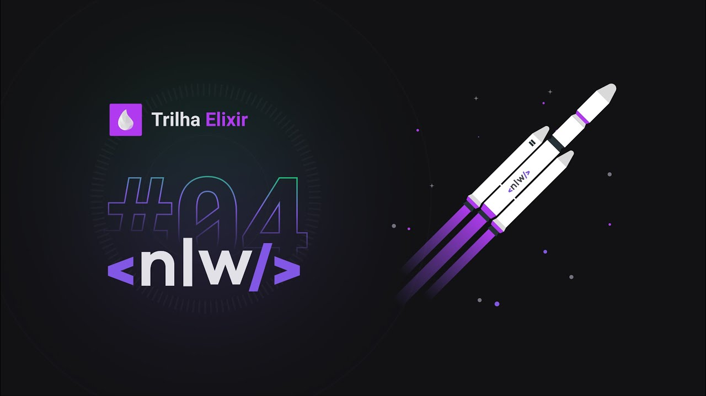

# **Next Level Week #4 - Elixir**

  

  

---

  

## **About RocketPay API**

  

This API is part of "Next Level Week #4 - Elixir Route", a intensive week of programming promoted by RocketSeat and taught by Rafael Camarda. RocketPay is an API using Elixir and Phoenix framework where users can transfers money to another users of the plataform.
  
  ---

> ## Built APIs

  

1. X

  

> ## Principles

  

* Functional Programming

* Small Commits
  

> ## Methodologies and Designs
  

* TDD

* Conventional Commits

* GitFlow

* Continuous Integration

* Continuous Delivery

* Continuous Deployment

  

> ## Libraries and Tools 

* Phoenix
* Credo  

> ## Elixir Features  

* Pattern matching
* Dynamic Typing
* Mix (Compiling)
* IEx (Elixir's_ interactive shell)

> ## Phoenix Features  

* Directory structure 
* Routing 
* Controllers 
* Views and templates 
* Ecto 
* Contexts 

> ## Tests Features
  

* Unitary tests
    
    

---

## 📝 License

This project is licensed under the GNU General Public License v3.0 - see the [LICENSE](LICENSE) file for details.

---

Made by Welton Leite 👋 [See my linkedin](https://www.linkedin.com/in/welton-leite-b3492985/)